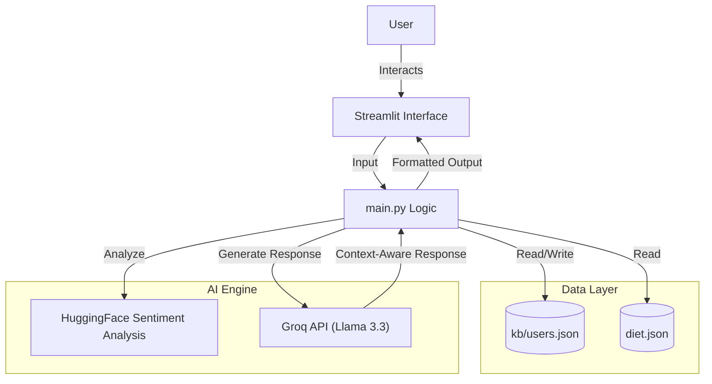

# 🏥 CareMate HealthBot

**A personalized, AI-powered medical health assistant helping you make informed health decisions.**

[](https://caremate-healthbot.streamlit.app/)

## 🔗 Live Demo
**[Try the Live App Here](https://caremate-healthbot.streamlit.app/)**

---

## 📖 Project Overview
**CareMate HealthBot** is an intelligent health assistant designed to provide general medical guidance, symptom analysis, nutrition advice, and mental health support. Built with **Streamlit** and powered by the **Groq API** (Llama 3.3 70B), it offers a conversational interface for users to discuss their health concerns in a safe, non-judgmental environment.

The bot maintains user context (age, gender, medical history) to provide personalized responses and avoids generic answers. It explicitly formats remedies in clear, step-by-step lists and always includes medical disclaimers.

## 🏗️ Structural Architecture

The application follows a modular architecture designed for simplicity and performance:



### Components
1.  **Streamlit Interface (`main.py`)**: Handles the frontend UI, session state management (chat history, user login), and input processing.
2.  **Logic Controller**:
    *   **Intent Detection**: Routes user queries to specific handlers (Symptom, Nutrition, Mental Health, Fitness).
    *   **Context Injection**: Injects user profile data (Age, Medical History) into AI prompts for personalized advice.
    *   **Sentiment Analysis**: Uses `distilbert` to detect user emotion and adjust response tone.
3.  **AI Engine**:
    *   **Groq API**: Generates human-like, medical-context-aware responses using the Llama 3.3 70B model.
4.  **Data Storage**:
    *   `kb/users.json`: Stores user profiles, medical history logs, and diet logs.
    *   `diet.json`: Contains database of unhealthy foods and healthy alternatives.

## ✨ Key Features
-   **Symptom Analysis**: Provides potential causes and self-care steps for reported symptoms.
-   **Diet & Nutrition**: Analyzes food intake, suggests healthy alternatives, and calculates BMI.
-   **Mental Health Support**: Offers coping strategies and grounding techniques with an empathetic tone.
-   **Medical Report Mode**: Allows users to log specific medical details into their persistent history.
-   **Context-Aware**: Remembers user details (e.g., "Lactose Intolerant") to avoid conflicting advice.

## 🚀 Getting Started Locally

### Prerequisites
-   Python 3.8+
-   Groq API Key

### Installation

1.  **Clone the repository**
    ```bash
    git clone https://github.com/Sriram4232/CareMate-HealthBot-.git
    cd CareMate-HealthBot-
    ```

2.  **Install dependencies**
    ```bash
    pip install -r requirements.txt
    ```

3.  **Set up secrets**
    Create a `.streamlit/secrets.toml` file:
    ```toml
    GROQ_API_KEY = "your_groq_api_key_here"
    ```

4.  **Run the app**
    ```bash
    streamlit run main.py
    ```

## ⚠️ Disclaimer
*This application is for educational purposes only and does not substitute professional medical advice. Always consult a licensed healthcare provider for medical concerns.*
